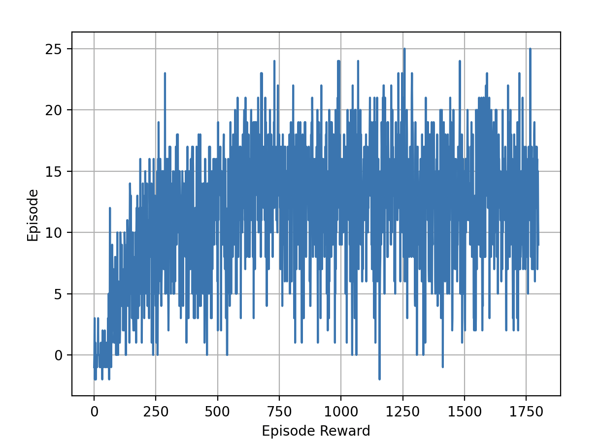

# Learning Algorithm
The algorithm used to solve the environment is a DQN. A DQN architecture is composed of two networks with **same architecture**:
- A local network. This is the network that actually learns the policy.
- A target network: This network is used to estimate the cumulative expected reward.

This two-network architecture is need to stabilizie training and avoid oscillations in the loss functions.
Using both networks, loss at a given timestep is computed as follows:
$$R+\gamma max_a\hat{q}(S',a,w^-)-\hat q(S,A,w)$$
Where:
 - $R$: is the reward obtained at the given timestep
 - $\gamma$: is the discount factor for future rewards. It allows us to give more importance to inmediate rewards and less importance to farther rewards.
 - $max_a\hat{q}(S',a,w^-)$: Is the highest (greediest) expected reward from timestep t on based on target network
 - $\hat q(S,A,w)$: is the expected cumulative reward using the local network.

 With this, we are learning from current reward $R$ and estimating future rewards using target network. After each local network update, target network is also updated using a soft update.

Regarding hyperparameters, find next values used for solving the environment:
- ITERATIONS=1800
- BATCH_SIZE=4
- GAMMA=0.99
- LEARNING_RATE=5e-4
- EPSILON_DECAY=0.997
- EPSILON_END=0.02

The following rewards are obtained from training.

As it can be seen in next image, environment was solved after 700 episodes.

# Future Improvements
Next improvements, prioritized (on impact and required work), can be implemented to boost training:
1. Prioritized Experience Replay: This would allow to sample experiences from the buffer based on how much the agent can learn from them. The more the agent can learn, the more likely it is for the experience to be selected for training.
2. Double DQN: Instead of relying blindly on the target network, it selects target expected cumulative reward from a combination of both, target and local networks.
3. Dueling DQN: Allows to sepparate the learning of the value function from the learning of the advantage function.
